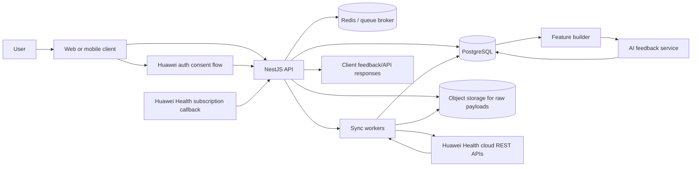
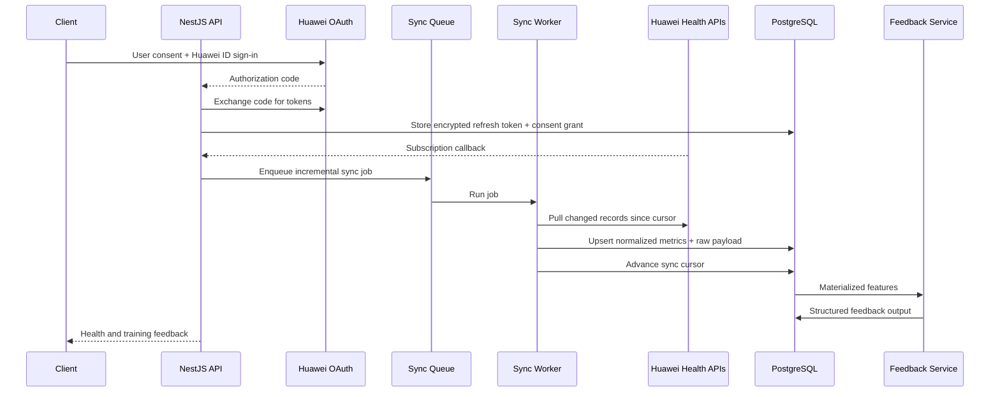

# Building a NestJS Platform on Huawei Health Data

## Executive summary

A NestJS backend that connects to Huawei Health, synchronizes user health and workout data, and generates AI-driven coaching feedback is technically feasible, but the phrase “sync all user data and Huawei analysis data” needs to be interpreted narrowly: you can sync all data that Huawei publicly exposes to your app, for the scopes you are approved for, on the devices and regions that support those data types. Huawei’s public stack includes app-oriented SDKs, cloud-side REST APIs for web and mobile apps, a subscription mechanism for event notifications, and a broad but not fully unrestricted set of basic, extended, and enterprise-gated data types. That means the right product promise is not “everything inside Huawei Health,” but “everything Huawei Health Service Kit publicly opens for this user, device, and approval tier.” citeturn48search16turn23search0turn23search3turn55search0turn55search3

The strongest architecture is a hybrid one. Let a client layer handle user sign-in and consent, keep the authorization-code exchange and refresh-token storage on the server, ingest Huawei data into a normalized time-series store, and run AI only on structured, quality-checked features rather than directly on raw event floods. Huawei’s own docs and samples support that split: OAuth authorization codes are short-lived and meant to be exchanged server-side; the platform also supports callback-based subscription notifications, with Huawei explicitly recommending that data be fetched asynchronously after the event instead of trying to do heavy processing inline. NestJS maps well to this architecture because its module/provider/controller model, scheduling support, and queue integrations are designed for exactly this kind of API-plus-worker topology. citeturn34search2turn36search2turn36search4turn36search7turn61search0turn65search22turn21search4turn21search0turn21search10turn21search2turn21search1

From a compliance perspective, this is a sensitive-data system from day one. Health data is special-category personal data under GDPR Article 9, must be limited to what is necessary under Article 5, secured under Article 32, documented under Article 30, breach-audited and potentially reported under Article 33, and likely assessed through a DPIA under Article 35. If the product ever makes medical rather than wellness/training claims, the regulatory burden rises sharply. The safest product posture is to frame the AI as an explanatory and coaching layer, not a diagnostic system. citeturn19search16turn19search10turn19search18turn20search2turn20search11turn20search1turn20search0turn20search8

The recommended MVP is: cloud-side REST plus a minimal companion client for sign-in and consent; sync daily activity, workouts, sleep, heart rate, SpO2, and a subset of health records; store normalized data in PostgreSQL with partitioning and JSONB payload retention; add subscriptions where Huawei supports them and polling everywhere else; then generate grounded feedback through a rules-plus-LLM pipeline with structured outputs, safety gating, and explicit medical disclaimers. citeturn23search0turn55search1turn56search22turn55search3turn22search0turn22search1turn68search0turn68search2

## Assumptions and feasibility

I assume no fixed hosting provider, no hard scale constraint, and permission to ship a user-facing companion client if Huawei’s auth and consent flow requires one. I also assume the product is a wellness/training/coaching application, not a regulated diagnostic or treatment product unless you later choose to market it that way.

The feasibility picture is asymmetrical. The public Huawei stack is strong for synchronized fitness and health records, but weaker than the phrase “all data” suggests in three places: raw-sensor access, enterprise-gated records, and device-specific gaps. Huawei’s official Kotlin sample shows a raw sampling dataset model via `DataCollector.DATA_TYPE_RAW`, and the extended capabilities docs explicitly open real-time exercise and real-time heart rate, but the public materials reviewed here do not show unrestricted export of arbitrary wearable waveform data such as full raw PPG or raw accelerometer streams. What Huawei clearly exposes is normalized atomic sampling data, exercise records, health records, and selected real-time feeds. citeturn15view0turn56search22turn55search5

A second feasibility constraint is that some data is gated by openness level and developer type. Huawei’s cloud-side open-data docs distinguish between basic data open to qualified individual and enterprise developers and advanced data that is not open to individual developers, and the broader developer onboarding docs note that enterprise developers can access more services than individual developers. In other words, if your target includes the more sensitive health-record categories and deeper event subscriptions, you should plan for enterprise registration and verification from the start rather than treat it as an optional cleanup task. citeturn23search3turn53search5turn53search10

A third constraint is that access can depend on device support, user settings, and Huawei Health app state. Huawei documents smartwatch retrieval for heart rate, resting heart rate, SpO2, stress, body temperature, and skin temperature, but also notes limits such as current-day-only step statistics, historical-only sleep-record access, and exercise-record support that is narrower than many product teams expect. Huawei also requires an additional `HEALTHKIT_HUAWEIHEALTH_LINK` scope for reading smartwatch data through Health Service Kit. citeturn16search0turn39search0turn40search0turn41search0turn43search0

The practical bottom line is below.

| Capability target | Feasibility | Why |
|---|---|---|
| OAuth-based user authorization and server-side sync | **High** | Huawei documents standard authorization-code flow, token refresh, and user-level credential exchange for app servers. citeturn30search0turn34search0turn34search2turn36search2turn36search4 |
| Web/mobile app plus NestJS backend using cloud-side REST | **High** | Huawei says cloud-side open capabilities support web and mobile apps through REST APIs. citeturn23search0turn65search9 |
| Native Android companion app with richer app-oriented SDK access | **High** | Huawei provides official Android SDK guides, sample repos, signing requirements, and scope-based auth flows. citeturn14view0turn15view0turn50search6turn67search3 |
| Broad health/frequency data sync | **Medium to High** | Steps, sleep, workouts, heart rate, SpO2, and many derived metrics are documented, but timeliness depends on device, connectivity, sync settings, and approval tier. citeturn55search1turn55search3turn51search9turn51search1 |
| Unrestricted raw wearable-sensor waveform export | **Low to Medium** | Public docs show raw sample-set semantics, not generalized unrestricted waveform export. citeturn15view0turn56search22 |
| “All Huawei analysis data” with no qualification | **Medium** | Huawei exposes many analysis-like data types, but some are advanced or certain-developer-only, and public docs do not present a single omnibus “all insights” endpoint. citeturn16search1turn59search15turn56search11turn62search2 |

Operationally, a backend-only implementation is not sufficient for smooth onboarding. Huawei’s docs repeatedly tie access to user authorization, Huawei ID sign-in, and Huawei Health app settings. On smartphones, users may need to open Huawei Health and enable Health Service Kit or data-syncing switches; on AppGallery/HMS integrations, the project itself also needs developer registration, project creation, app signing, and scope approval. citeturn50search5turn50search2turn69search7turn51search1turn51search5

## Huawei Health platform analysis

Huawei’s public health platform is now best understood as three distinct integration modes: app-oriented Health Service Kit SDKs, cloud-side REST APIs, and the separate Health Industry SDK for qualified commercial-wearable scenarios rather than ordinary consumer Huawei Health syncing. The product page says Health Kit supports Android, iOS, Web, Quick App, and HarmonyOS; Huawei’s cloud-side docs say web apps and mobile apps can access the data platform through REST; and the open-data overview separates basic capabilities from extended capabilities and from cloud-side openness. citeturn48search16turn23search0turn55search1turn56search22

The API choice that matters most for a NestJS backend is summarized below.

| API option | What it gives you | Best use | Main limits |
|---|---|---|---|
| App-oriented SDK, basic capabilities | Native app access to atomic sampling data and broad health/fitness reads and writes through Huawei’s client SDK model. Official samples show scope-based authorization via `SettingController.requestAuthorizationIntent(...)`. citeturn14view0turn55search0 | Android companion app, direct on-device UX, user-driven sync, writing data back into Huawei Health | Tied to native app integration and Huawei client prerequisites |
| App-oriented SDK, extended capabilities | Real-time exercise and real-time heart-rate access plus some basic atomic types. citeturn56search22turn52search3 | Live workout experiences, live coaching, wearable-linked telemetry | Narrower than generic “all sensor data”; more app-side complexity |
| Cloud-side REST APIs | Server-friendly HTTPS endpoints under `health-api.cloud.huawei.com/healthkit/v2`, covering data collectors, sampling datasets, health records, user info, and subscriptions. citeturn63search1turn64search3turn64search5turn62search22 | NestJS backends, scheduled sync, central storage, AI pipelines | Requires per-user OAuth tokens; some data types and openness levels are gated |
| Health Industry SDK | Commercial-wearable connectivity, continuous sharing, and real-time device-side industry scenarios. Huawei positions it for qualified industry use and commercial wearables. citeturn27search0turn27search4 | B2B healthcare, insurer, clinic, workplace, or device-partner deployments | Not the default path for standard consumer Huawei Health app syncing |

Developer onboarding is more involved than a normal OAuth-only SaaS integration. Huawei requires a HUAWEI ID and identity verification to turn it into a developer account, then project creation, service application, and scope approval. For native Android integrations, Huawei documents signing-certificate generation and fingerprint configuration; AppGallery Connect exposes the OAuth 2.0 client ID and client secret in project settings; and Health Service Kit access itself must be explicitly applied for. During the test phase, Huawei also documents a limit of 100 users until the application is verified. citeturn50search5turn50search2turn50search6turn50search0turn53search2turn53search4

For authorization, the key server-side flow is a classic OAuth authorization-code exchange. Huawei’s docs show the authorization endpoint at `https://oauth-login.cloud.huawei.com/oauth2/v3/authorize`, the token endpoint at `https://oauth-login.cloud.huawei.com/oauth2/v3/token`, a one-time authorization code that is valid for 5 minutes, a 60-minute access token, and a refresh token with a 180-day validity window. Huawei’s own Account Kit codelab also explicitly says the code-to-token exchange contains the app secret and therefore belongs on your app server, not in the client. citeturn34search0turn34search1turn34search2turn35search2turn36search2turn36search4turn36search7

An illustrative server-side OAuth sequence looks like this:

```http
GET https://oauth-login.cloud.huawei.com/oauth2/v3/authorize
  ?response_type=code
  &access_type=offline
  &client_id=YOUR_CLIENT_ID
  &redirect_uri=https%3A%2F%2Fyour-app.example%2Fauth%2Fhuawei%2Fcallback
  &scope=openid%20profile
  &state=opaque_csrf_token

POST https://oauth-login.cloud.huawei.com/oauth2/v3/token
Content-Type: application/x-www-form-urlencoded

grant_type=authorization_code&
code=AUTH_CODE&
client_id=YOUR_CLIENT_ID&
client_secret=YOUR_CLIENT_SECRET&
redirect_uri=https%3A%2F%2Fyour-app.example%2Fauth%2Fhuawei%2Fcallback
```

```json
{
  "access_token": "…",
  "refresh_token": "…",
  "id_token": "…",
  "scope": "openid profile email",
  "token_type": "Bearer",
  "expires_in": 3600
}
```

That request shape is directly aligned with Huawei’s OAuth docs and codelab material, even though in practice you will add state verification, encrypted token persistence, and rotation-aware refresh handling. citeturn34search0turn34search1turn35search2turn36search2turn36search4turn36search7

On scopes, Huawei’s own sample code is the most concrete public source: the official Kotlin demo includes step, height/weight, heart-rate, activity-record, and heart-health scopes in the initial authorization array. Individual data-type pages then map scopes to console categories, such as `HEALTHKIT_HEARTRATE_READ` for heart rate and `HEALTHKIT_PULMONARY_READ` for pulmonary-function data like VO2 max. Smartwatch retrieval also needs the additional Huawei Health linking scope. citeturn14view0turn38search0turn17search0turn43search0

The broad data surface is substantial. Huawei groups cloud-side data into atomic sampling data, exercise record data, and health record data. Public docs and overview pages list daily activity metrics such as steps, active calories, distance, altitude, moderate-to-high intensity, hours active, and workout goals; sport metrics such as running form; health sampling data such as height, weight, sleep status, heart rate, stress, blood glucose, blood pressure, SpO2, body temperature, ECG measurement details, reproductive health, maximum oxygen uptake, heart-rate variability, respiratory rate, emotion, and resting calories; and health records such as ECG records, sleep records, tachycardia/bradycardia, menstrual-cycle data, sleep-breathing records, low SpO2 records, ABPM reports, and high body temperature. citeturn16search4turn55search0turn55search3turn59search15turn60search3turn60search6

For the data classes you explicitly care about, the practical picture looks like this:

| Requested category | Public Huawei shape | Important notes |
|---|---|---|
| Raw sensor / atomic detail | Sample-set model with raw data generation type, plus atomic detailed/statistical sampling data. citeturn15view0turn55search4 | Public docs show raw sample semantics, not unrestricted arbitrary waveform export |
| Activity / daily activity | Steps, calories, distance, altitude, activity intensity, hours active, daily activity summaries, workout goals. citeturn55search0turn58search2turn59search4 | Good fit for coaching dashboards and training adherence |
| Sleep | Sleep status as sampling data and sleep records as health records. citeturn55search10turn55search3 | Huawei also documents sleep-breathing records as an additional health-record class |
| Heart rate | Heart rate, resting heart rate, real-time heart rate, HRV, heart-rate zones in some wearable-industry docs. citeturn16search0turn38search2turn59search2 | Good coaching signal; still not a diagnosis surface |
| SpO2 | Sampling data plus low-SpO2 health records. citeturn56search2turn56search11 | Availability can depend on device support and automatic-measurement settings |
| Huawei-produced analysis / insight-like outputs | VO2 max, running form, workout goals, activity rings, sleep breathing, tachycardia/bradycardia, ABPM, high body temperature, respiratory rate, emotion. citeturn55search18turn58search0turn59search4turn59search1turn16search1turn59search3turn59search15turn60search0 | Publicly exposed as structured data types or records, not as one catch-all narrative analysis API |

The REST endpoint families are also clear enough to design against, even if the exact body shape varies by method. Huawei’s reference shows a common base under `https://health-api.cloud.huawei.com/healthkit/v2/`. Public snippets expose, for example, a user-information endpoint at `/user`, health-record retrieval under `/healthRecords`, and some delete operations nested under `/dataCollectors/.../healthRecords`. The REST reference also enumerates families for data collectors, sampling datasets, activity records, health records, and subscriptions. citeturn63search1turn64search3turn64search5turn44search7turn62search22

Representative endpoint examples from the official reference are:

```http
GET https://health-api.cloud.huawei.com/healthkit/v2/user
GET https://health-api.cloud.huawei.com/healthkit/v2/healthRecords?...
DELETE https://health-api.cloud.huawei.com/healthkit/v2/dataCollectors/{dataCollectorId}/healthRecords?...
```

Huawei’s surfaced user-info reference explicitly says that endpoint returns a user’s gender and age. For health-record and sample-set methods, the exact request and response bodies are resource-specific, so in practice you should implement one typed adapter per endpoint family instead of a single “generic Huawei parser.” citeturn64search3turn63search1turn69search17

The official subscription mechanism is valuable, but it does not eliminate polling. Huawei says Health Service Kit can send notifications to a subscriber callback address when user events change, and separately recommends fetching data asynchronously after a notification to avoid long response delays during event handling. At the same time, Huawei’s timeliness docs say real-time availability cannot be guaranteed if wearables are disconnected, the phone is offline, or cloud synchronization has not happened yet; users can even be asked to manually sync in Huawei Health to improve freshness. That combination strongly favors a hybrid design: subscriptions for event triggers, incremental polling for gap repair. citeturn61search0turn64search8turn65search22turn51search9turn51search1turn56search6

On rate limits, the public primary sources reviewed here describe endpoints, scopes, event notifications, and result-code structures, but I did not find publicly documented per-app or per-user numeric quotas for Health Service Kit itself. Huawei’s broader API agreement states that Huawei may monitor API usage for quality, product improvement, and compliance verification. The conservative engineering implication is to build your own throttling, exponential backoff, cursor-based resumption, and customer-visible freshness indicators instead of assuming unlimited throughput. citeturn25search1turn18search15

Known limitations are significant enough to influence product scope. Availability is not guaranteed in all countries or regions; some advanced records are reserved for enterprise or certain-developer access; smartwatch access needs extra linking scope; some health metrics depend on user-configured measurement switches; and some publicly documented smartwatch queries are surprisingly narrow, such as current-day-only step summaries or limited exercise-record types. These are not edge cases — they are core product constraints. citeturn18search2turn23search3turn56search11turn62search2turn43search0turn56search8turn39search0turn41search0

## NestJS backend architecture

A strong NestJS design should separate user-facing API traffic, Huawei synchronization, storage normalization, and AI generation into distinct modules and worker paths. Nest’s own documentation describes modules as the unit of application organization, providers as the native abstraction for injectable services, controllers as the HTTP boundary, `@nestjs/schedule` for recurring work, and queue support for managed background jobs. That maps cleanly to a health-sync system with token refreshers, backfill jobs, notification handlers, and feedback generators. citeturn21search4turn21search0turn21search10turn21search2turn21search1

A recommended deployment-level architecture is:



Functionally, the module split should look like this. `AuthModule` owns Huawei OAuth state, token exchange, refresh, and revocation. `HuaweiModule` owns typed REST/SDK adapters and endpoint-specific parsers. `SyncModule` owns backfills, incremental pulls, retry windows, and subscription-triggered sync jobs. `IngestionModule` owns validation, deduplication, provenance, and normalization. `MetricsModule` exposes application queries for charts, dashboards, and user exports. `FeedbackModule` produces features and AI responses. `ComplianceModule` owns consent ledgers, audit logs, deletion/export workflows, and operational security controls. That shape follows Nest’s design philosophy and helps you deploy API pods and worker pods independently. citeturn21search4turn21search0turn21search10turn21search6turn21search15

For the primary database, PostgreSQL is the best default unless you already know the product is overwhelmingly write-heavy and schema-light. Official PostgreSQL docs emphasize declarative partitioning and JSONB support, which is exactly what you want for time-partitioned metric tables plus retained raw payloads. A time-series extension on top of PostgreSQL is worth adding once the sample volume becomes large enough that continuous aggregations or chunk management materially help. MongoDB’s time-series collections are a real option, but they are usually weaker for the relational integrity you want around consent grants, token ownership, auditability, and user deletion workflows. citeturn22search0turn22search1turn22search19turn22search11turn22search2turn22search6

The database trade-off is below.

| Database option | Strengths | Weaknesses | Recommendation |
|---|---|---|---|
| PostgreSQL | Native JSON/JSONB support and declarative partitioning, excellent transactional integrity, easy relational joins for users/consents/tokens/records. citeturn22search1turn22search0 | More schema management upfront | **Default choice** |
| PostgreSQL plus time-series extension | All PostgreSQL benefits plus hypertable-style scaling and stronger real-time analytics patterns. citeturn22search11turn22search19 | Extra operational moving part | Best once data volume grows |
| NoSQL time-series store from entity["company","MongoDB","database company"] | Official time-series collections are built for sequences of measurements over time. citeturn22search2turn22search6 | Weaker fit for relational compliance and consent/audit joins | Use only if your team is already standardized on it |

The normalized data model should preserve both semantically useful health facts and Huawei provenance. In practice, that means at least these tables: `user`, `consent_grant`, `oauth_token`, `data_source`, `device`, `metric_sample`, `activity_session`, `sleep_session`, `health_record`, `sync_cursor`, `sync_job`, `feedback_event`, and `audit_log`, plus a `huawei_raw_payload` table or object-store bucket keyed by source event ID. The most important design decision is to separate normalized facts from vendor payloads instead of forcing one table to do both jobs.

For mapping, treat Huawei data as three families. Atomic/sampling data belongs in `metric_sample`, with one row per interval or measurement and a metric type like `steps`, `heart_rate`, `spo2`, `stress`, `body_temperature`, or `vo2max`. Exercise records belong in `activity_session`, with workout type, duration, route or lap metadata, and summary metrics. Health records belong in `health_record`, with record classes like `sleep_record`, `sleep_breathing`, `tachycardia`, `low_spo2`, `abpm_report`, or `high_body_temperature`. This mirrors Huawei’s official taxonomy and makes your AI layer far easier to keep grounded. citeturn16search4turn55search3turn60search6

A good data-flow design is:



On webhook versus polling, the right answer is not “either/or.” Use Huawei subscriptions where available because they reduce staleness and unnecessary polling, but immediately follow the notification with an asynchronous pull from the last stored cursor. Huawei explicitly recommends that post-notification data retrieval pattern, and it is necessary because timeliness is not guaranteed by the device/cloud path alone. Polling should still run on a schedule for unsupported data types, missed notifications, token-expiry recovery, and backfill repair. In practice, I would schedule high-signal metrics such as heart rate, SpO2, sleep, and recent activity every 15 to 60 minutes, and broader historical reconciliation once or twice daily. citeturn61search0turn64search8turn65search22turn51search9turn51search1

Conflict resolution should be deterministic. Use idempotent upserts keyed on `(user_id, source, external_id)` when Huawei gives you stable IDs, and otherwise on `(user_id, metric_type, interval_start, interval_end, source_device_id)`. Preserve the latest raw payload version for forensics, but resolve normalized conflicts by preferring the freshest Huawei-cloud record over older client-uploaded copies. Never hard-delete on first discrepancy; mark as superseded or tombstoned until the next full reconciliation window.

The following NestJS snippets illustrate the server-side patterns that fit Huawei’s auth and sync model.

The first snippet keeps the authorization-code exchange on the server, which is exactly what Huawei recommends because the request contains the client secret. citeturn36search7turn34search2

```ts
// auth/huawei-auth.controller.ts
import { Controller, Get, Query, Req } from '@nestjs/common';
import { Request } from 'express';
import { HuaweiAuthService } from './huawei-auth.service';

@Controller('auth/huawei')
export class HuaweiAuthController {
  constructor(private readonly authService: HuaweiAuthService) {}

  @Get('callback')
  async callback(
    @Req() req: Request,
    @Query('code') code: string,
    @Query('state') state: string,
  ) {
    await this.authService.assertState(req, state);

    const session = await this.authService.exchangeAuthorizationCode(code);

    return {
      connected: true,
      userId: session.appUserId,
      huaweiSubject: session.huaweiSubject,
      expiresAt: session.expiresAt.toISOString(),
    };
  }
}
```

```ts
// auth/huawei-auth.service.ts
import { Injectable, UnauthorizedException } from '@nestjs/common';
import { HttpService } from '@nestjs/axios';
import { firstValueFrom } from 'rxjs';

@Injectable()
export class HuaweiAuthService {
  constructor(
    private readonly http: HttpService,
    private readonly tokenRepo: OAuthTokenRepository,
    private readonly crypto: EnvelopeCryptoService,
  ) {}

  async assertState(req: any, returnedState: string): Promise<void> {
    const expected = req.session?.oauthState;
    if (!expected || expected !== returnedState) {
      throw new UnauthorizedException('Invalid OAuth state');
    }
  }

  async exchangeAuthorizationCode(code: string) {
    const body = new URLSearchParams({
      grant_type: 'authorization_code',
      code,
      client_id: process.env.HUAWEI_CLIENT_ID!,
      client_secret: process.env.HUAWEI_CLIENT_SECRET!,
      redirect_uri: process.env.HUAWEI_REDIRECT_URI!,
    });

    const { data } = await firstValueFrom(
      this.http.post(
        'https://oauth-login.cloud.huawei.com/oauth2/v3/token',
        body.toString(),
        {
          headers: { 'Content-Type': 'application/x-www-form-urlencoded' },
        },
      ),
    );

    // TODO: verify the id_token signature and claims before trusting `sub`.
    const huaweiSubject = decodeJwt(data.id_token).sub as string;
    const encryptedRefresh = await this.crypto.encrypt(data.refresh_token);

    await this.tokenRepo.upsert({
      provider: 'huawei',
      huaweiSubject,
      accessToken: data.access_token,
      refreshTokenEncrypted: encryptedRefresh,
      scope: data.scope,
      expiresAt: new Date(Date.now() + data.expires_in * 1000),
    });

    return {
      appUserId: huaweiSubject,
      huaweiSubject,
      expiresAt: new Date(Date.now() + data.expires_in * 1000),
    };
  }
}
```

The second snippet models webhook-style ingestion. Huawei’s subscription docs say the platform can notify a callback address and recommend doing the actual data pull asynchronously after the event. citeturn61search0turn65search22

```ts
// sync/huawei-webhook.controller.ts
import { Body, Controller, Post, HttpCode } from '@nestjs/common';
import { SyncQueueService } from './sync-queue.service';

interface HuaweiSubscriptionEventDto {
  userId: string;
  eventType: string;
  eventTime: string;
  recordType?: string;
}

@Controller('webhooks/huawei')
export class HuaweiWebhookController {
  constructor(private readonly queue: SyncQueueService) {}

  @Post('health')
  @HttpCode(202)
  async receive(@Body() event: HuaweiSubscriptionEventDto) {
    await this.queue.enqueueIncrementalSync({
      userId: event.userId,
      eventType: event.eventType,
      eventTime: new Date(event.eventTime),
      recordType: event.recordType ?? null,
    });

    return { accepted: true };
  }
}
```

The third snippet shows one way to store normalized metrics while still preserving Huawei provenance.

```ts
// metrics/metric-sample.entity.ts
import { Column, Entity, Index, PrimaryGeneratedColumn } from 'typeorm';

@Entity({ name: 'metric_samples' })
@Index(['userId', 'source', 'externalId'], { unique: true })
export class MetricSampleEntity {
  @PrimaryGeneratedColumn('uuid')
  id!: string;

  @Column({ type: 'uuid' })
  userId!: string;

  @Column({ type: 'text' })
  source!: 'huawei';

  @Column({ type: 'text' })
  externalId!: string;

  @Column({ type: 'text' })
  metricType!: string; // steps, heart_rate, spo2, stress, vo2max, etc.

  @Column({ type: 'timestamptz' })
  startTime!: Date;

  @Column({ type: 'timestamptz', nullable: true })
  endTime!: Date | null;

  @Column({ type: 'numeric', nullable: true })
  valueNumeric!: string | null;

  @Column({ type: 'text', nullable: true })
  valueText!: string | null;

  @Column({ type: 'text', nullable: true })
  unit!: string | null;

  @Column({ type: 'text', nullable: true })
  deviceId!: string | null;

  @Column({ type: 'jsonb' })
  rawPayload!: Record<string, unknown>;
}
```

```ts
// metrics/metric-ingestion.service.ts
import { Injectable } from '@nestjs/common';
import { Repository } from 'typeorm';

interface HuaweiMetricDto {
  externalId: string;
  type: string;
  startTime: string;
  endTime?: string | null;
  valueNumeric?: number | null;
  valueText?: string | null;
  unit?: string | null;
  deviceId?: string | null;
  raw: Record<string, unknown>;
}

@Injectable()
export class MetricIngestionService {
  constructor(private readonly repo: Repository<MetricSampleEntity>) {}

  async upsertHuaweiMetric(userId: string, dto: HuaweiMetricDto) {
    const entity = this.repo.create({
      userId,
      source: 'huawei',
      externalId: dto.externalId,
      metricType: dto.type,
      startTime: new Date(dto.startTime),
      endTime: dto.endTime ? new Date(dto.endTime) : null,
      valueNumeric:
        dto.valueNumeric === undefined || dto.valueNumeric === null
          ? null
          : String(dto.valueNumeric),
      valueText: dto.valueText ?? null,
      unit: dto.unit ?? null,
      deviceId: dto.deviceId ?? null,
      rawPayload: dto.raw,
    });

    await this.repo.upsert(entity, {
      conflictPaths: ['userId', 'source', 'externalId'],
      skipUpdateIfNoValuesChanged: true,
    });

    return entity;
  }
}
```

## Security privacy and compliance

Because this system processes health data, GDPR is not a generic checklist item here; it is the center of the design. Article 9 treats data concerning health as special-category personal data. Article 5 requires that processing be limited to what is adequate, relevant, and necessary. Article 32 requires security measures proportionate to risk. Article 30 requires records of processing activity. Article 33 requires breach documentation and, where relevant, supervisory notification within 72 hours. Article 35 requires a DPIA when new technology and high-risk processing are likely to affect individuals’ rights and freedoms. citeturn19search16turn19search10turn19search18turn20search2turn20search15turn20search1

Huawei’s own Health Service Kit onboarding docs reinforce a least-privilege approach: when adding Health Service Kit, the requested scopes must match the business scenario and developers should not request unnecessary permissions. That aligns almost perfectly with what your own consent model should do. Do not ask for “all health data” just because the platform may allow it. Ask separately for activity, training, sleep, heart-related signals, SpO2, and record-level insights only when each is needed for a clearly disclosed feature. citeturn24search0turn61search13

The backend should therefore maintain an explicit consent ledger, not just a current token row. Store which Huawei scopes were granted, which in-app features they unlock, when consent was shown, which privacy-policy version applied, and when a user withdrew or narrowed consent. Make feature flags depend on consent-grant rows, not merely on the presence of a valid access token. That is the cleanest path for data minimization, erasure, and auditability.

Encryption needs to be layered. Access tokens are short-lived and can live in volatile memory or short-retention storage; refresh tokens should be envelope-encrypted with a cloud KMS or HSM-backed service. All health payloads should travel over TLS and be encrypted at rest; especially sensitive health-record classes should get field-level encryption or a separate schema boundary. Audit logs should never contain raw tokens, full OAuth responses, or full AI prompts containing user health histories. Article 32 does not prescribe exact cryptographic algorithms, but it clearly expects state-of-the-art technical and organizational measures proportionate to the risks of unauthorized disclosure, loss, or alteration. citeturn19search18turn20search11

At the application layer, NestJS’s own security guidance is directly useful. Use Helmet for security headers, CSRF protection where cookie-bound browser sessions are involved, and rate limiting on auth and webhook endpoints. Split API roles cleanly so that operational dashboards, support tooling, AI evaluation tools, and end-user APIs do not all share the same privilege plane. citeturn21search7turn21search3turn21search11

Regional qualification also matters. Huawei’s Health Kit service agreement states that the service is not available in all countries or regions and that availability in a specific location is not guaranteed. Huawei’s openness docs also distinguish between data that individual developers can access and advanced data that require enterprise eligibility. So your product requirements, legal copy, and onboarding UX should be region-aware from the outset rather than assuming one global uniform capability set. citeturn18search2turn23search3turn53search10

If you later move from wellness/training feedback into explicit medical-intent features, you should expect a regulatory threshold change. The entity["organization","European Commission","eu executive body"] notes that AI-based software intended for medical purposes falls into the high-risk category under the EU AI framework and must meet stricter obligations, including risk mitigation, high-quality data, clear user information, and human oversight. That is a very different product from an AI coach that says “your sleep has trended down and your recent training volume is high.” citeturn20search0turn20search8

Deletion and portability should be first-class, not backlog items. Locally, users need export and erasure workflows that cover normalized tables, raw payloads, cached features, and generated feedback. On the Huawei side, remember the distinction between data you imported into Huawei Health and data you merely synchronized from it. Huawei’s own SDK sample `clearAll()` deletes data inserted by the current app from device and cloud, which is useful if your app writes back into the ecosystem, but it does not replace your obligation to delete your own stored synchronized copy when a user leaves your service. citeturn15view0

## AI feedback system design

The AI layer should be designed as a grounded recommendation engine, not as a free-form “LLM reads health data” feature. The model should never be the first place raw vendor telemetry goes. The robust flow is: normalize Huawei signals; compute quality checks and rolling features; run deterministic safety gates; pass a compact feature packet to the model; require a structured output schema; then apply post-generation validation before any feedback reaches the user. That architecture is supported by current model-platform guidance from leading providers, which increasingly emphasizes structured outputs, tool calling, and evaluation-driven iteration rather than prompt-only improvisation. citeturn68search0turn68search1turn68search15turn68search7turn68search2

For model choice, there is no single winner. The trade-off is mostly between control and operational convenience.

| Model option | Why it is relevant | Best fit |
|---|---|---|
| Managed API from entity["company","OpenAI","AI company"] | OpenAI’s current platform docs emphasize frontier models, function calling, structured outputs, prompt engineering, and agent/workflow evaluation support. citeturn54search16turn68search0turn68search15turn68search17 | Fastest path to high-quality coaching text and agent tooling |
| Managed API from entity["company","Anthropic","AI company"] | Anthropic’s docs emphasize model families, tool use, structured outputs, prompt consistency, and zero-data-retention arrangements on eligible features. citeturn54search1turn68search7turn68search19turn68search22 | Strong choice when you want provider-managed inference with guardrail-oriented prompting |
| Open-weight models from entity["company","Meta","technology company"] | Meta positions Llama 4 Scout and Maverick as open-weight multimodal models; the Llama model pages also emphasize deployment flexibility. citeturn54search18turn54search2turn54search14 | Best when data residency and self-hosting dominate |
| Open-weight and commercial models from entity["company","Mistral AI","AI company"] | Mistral’s docs explicitly position part of its line as open-weight and part as commercial, with a current model catalog spanning compact to frontier-grade options. citeturn54search7turn54search3 | Good if you want a self-host / managed hybrid menu |

My recommendation is a dual-layer approach. Run deterministic feature engineering plus optional smaller open-weight models inside your own environment for PHI-heavy preprocessing and classification, then use a stronger managed model only for well-bounded language generation over de-identified, already-structured features if your privacy and vendor-contract posture allows it. If your privacy posture is stricter, keep the whole stack self-hosted and accept some quality trade-offs initially.

The most important preprocessing pipeline is not glamorous, but it determines whether the AI is useful. The pipeline should: validate timestamps and units; deduplicate overlapping samples; compute data completeness and freshness; collapse minute-level records into rolling windows; generate interpretable features such as weekly step volume, sleep duration trend, recent resting-heart-rate baseline shift, SpO2 stability, workout adherences, and trend deltas; then pass only those features forward. For many use cases, the model never needs the raw sample stream at all.

Prompt engineering should also be conservative. Give the model a role such as “exercise and recovery coach,” not “doctor.” Provide explicit tool-grounded facts, not open-ended health history prose. Ask it to explain only what is present in the supplied features and record types. Require JSON output with fields such as `summary`, `positive_signals`, `training_feedback`, `recovery_feedback`, `follow_up_questions`, `safety_flags`, and `disclaimer`. Current provider docs from both OpenAI and Anthropic recommend structured outputs for schema conformance rather than relying on prompt discipline alone, and OpenAI’s platform docs separately emphasize evaluation as a core production practice. citeturn68search0turn68search1turn68search21turn68search2turn68search14

Personalization should be feature-based, not persona-based. Use a rolling baseline per user, goal preferences such as fat loss, endurance, general fitness, recovery, or consistency, a preferred tone, locale, schedule constraints, and device reliability metadata. A user with irregular sync quality should receive “low confidence” coaching that says the data looks incomplete. A user with six months of stable wearable history can receive sharper trend commentary. The hidden win here is trust: users forgive modest intelligence faster than they forgive fake certainty.

Evaluation has to cover more than “sounds good.” At minimum, score schema validity, groundedness to source features, contradiction rate, safety-trigger recall, false reassurance rate, user-rated helpfulness, and actionability. Also track operational metrics: time-to-feedback, token cost, queue lag, and percentage of outputs that are auto-blocked or degraded to a template response. OpenAI’s eval guides are especially clear that production AI quality comes from explicit eval design, traces, graders, and iteration loops, not from static prompt craftsmanship. citeturn68search2turn68search14turn68search17

Safety should be encoded twice: once before generation and once after. Before generation, any Huawei record type that already implies abnormality — for example, tachycardia/bradycardia, low-SpO2 records, sleep-breathing records, ABPM reports, or high-body-temperature records — should push the system into a caution mode that avoids overconfident interpretation. After generation, validate that the answer contains no diagnosis, no claims of certainty, no medication or treatment advice, and no contradiction of the source facts. Huawei publicly documents these record classes; use them as escalators, not as raw material for improvised medical reasoning. citeturn16search1turn62search12turn59search3turn56search11turn62search2

The user-facing disclaimer should be clear and stable: this is health and training feedback for general wellness and recovery insight, not diagnosis, emergency triage, or treatment advice. When the underlying data already contains a Huawei-defined abnormal record type or the user reports acute symptoms, the assistant should stop coaching and recommend appropriate professional care.

## Implementation roadmap

The implementation path below assumes a single NestJS codebase with separately deployed API and worker processes.

| Milestone | Deliverable | Effort |
|---|---|---|
| Access readiness | Register developer account, complete identity verification, create Huawei project, apply for Health Service Kit, obtain scopes, configure OAuth client, and decide whether enterprise verification is needed | **Medium** |
| Consent and auth foundation | Build Huawei sign-in flow, authorization-code callback, encrypted refresh-token storage, consent ledger, token refresh jobs, and revocation path | **Medium** |
| Ingestion MVP | Sync user profile, daily activity, workouts, sleep, heart rate, and SpO2 into normalized PostgreSQL tables; attach raw payload retention | **High** |
| Reliability layer | Add queue-backed backfills, cursor-based incrementals, retry windows, freshness tracking, and observability dashboards | **High** |
| Subscription integration | Register callback address, receive Huawei event notifications, and combine them with incremental pulls | **Medium** |
| Expanded health records | Add health-record families such as sleep breathing, low SpO2, tachy/brady, ABPM, VO2 max, HRV, and running form where scopes and developer tier allow | **Medium to High** |
| AI coaching alpha | Build feature store, structured prompt/output pipeline, rule-based safety gates, and internal review UI | **High** |
| Evaluation and hardening | Add schema checks, groundedness evals, red-team suites, user feedback capture, and model/prompt version registry | **High** |
| Production rollout | CI/CD split for API and workers, canary releases, feature flags, rollback plans, and user-visible freshness/confidence signals | **Medium** |

Testing should happen at four layers. First, unit-test every mapper from Huawei payload to normalized tables. Second, contract-test OAuth token exchange and refresh with recorded fixtures. Third, integration-test end-to-end synchronization on dedicated Huawei test accounts and supported devices, because some of the most important issues are device-state and sync-setting related rather than code bugs. Fourth, shadow-test the AI pipeline offline before exposing it to users. AppGallery Connect’s own review guidance points developers to Cloud Testing and Cloud Debugging to catch issues before release review, which is a useful final layer for any companion-mobile-client strategy. citeturn53search9turn48search8

For CI/CD, deploy three artifacts independently: the public API, the sync workers, and the AI-feedback workers. Nest’s deployment docs explicitly anticipate APIs, background workers, scheduled tasks, and CI/CD pipelines in the same ecosystem, so this separation is operationally natural rather than a framework hack. Database migrations should be forward-compatible; prompt and model versions should be feature-flagged; and every production rollout should support per-user or per-tenant rollback for both sync behavior and AI generation. citeturn21search6turn21search2

Monitoring should cover technical and product-level telemetry: OAuth success rate, refresh-token failure rate, Huawei API latency, sync lag from event time to database time, per-data-type completeness, number of duplicate drops, number of subscription callbacks received, AI safety-block rate, structured-output failure rate, feedback latency, and user correction rate. The most important SLO is not raw uptime; it is “fresh enough, complete enough, and safe enough to be useful.”

Rollback strategy should be explicit. You need the ability to disable one Huawei data family without disabling the whole integration, to revert to polling-only mode if subscription callbacks misbehave, to freeze AI generation and fall back to deterministic template output, and to revert prompt/model versions independently from the rest of the system. Store prompt hashes, model IDs, and feature payload versions with every generated feedback event so you can audit and unwind changes with confidence.

The shortest sensible path to production is therefore: secure developer approval and scopes, ship OAuth and token management, sync the high-value core metrics into a PostgreSQL schema that preserves raw provenance, add subscription callbacks as hints rather than absolute truth, and only then layer AI on top of curated features. That sequence respects Huawei’s platform realities, NestJS’s strengths, and the compliance burden of building on health data.